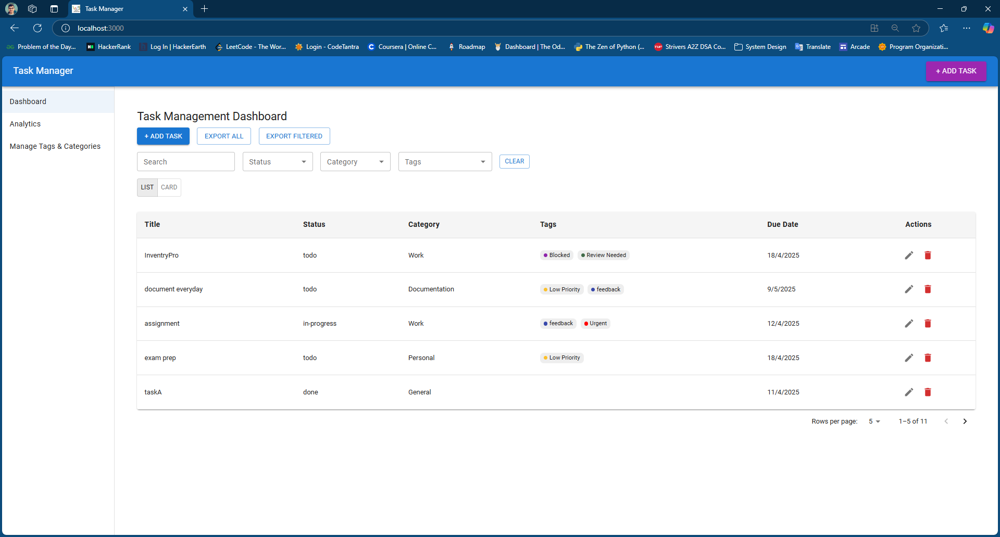
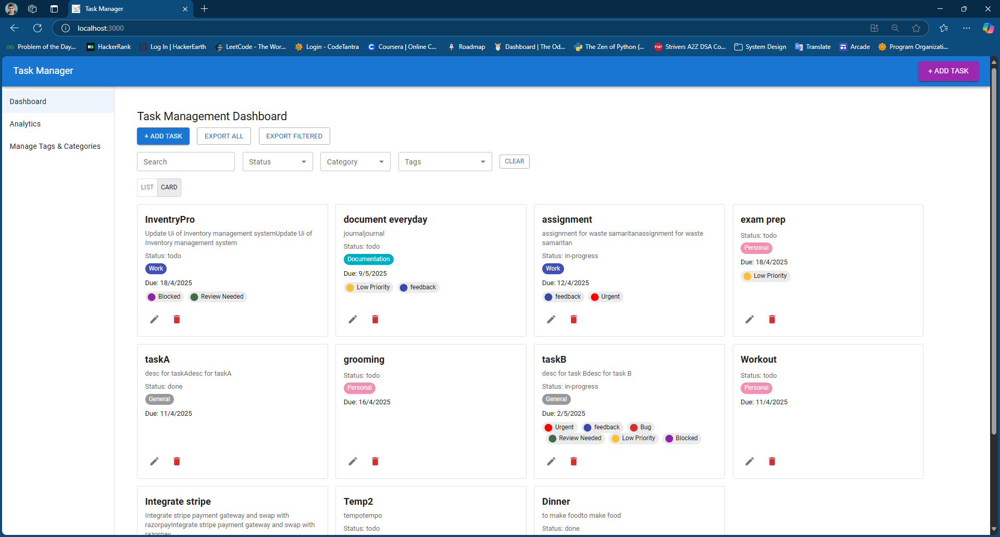
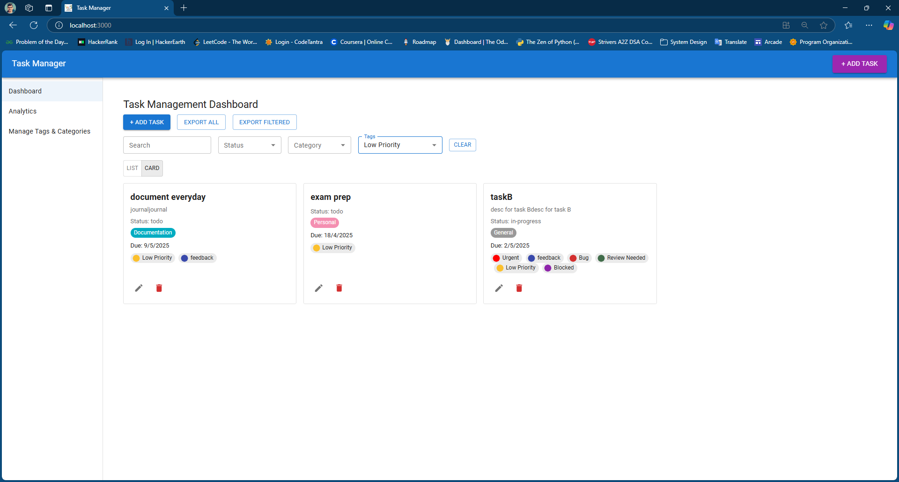
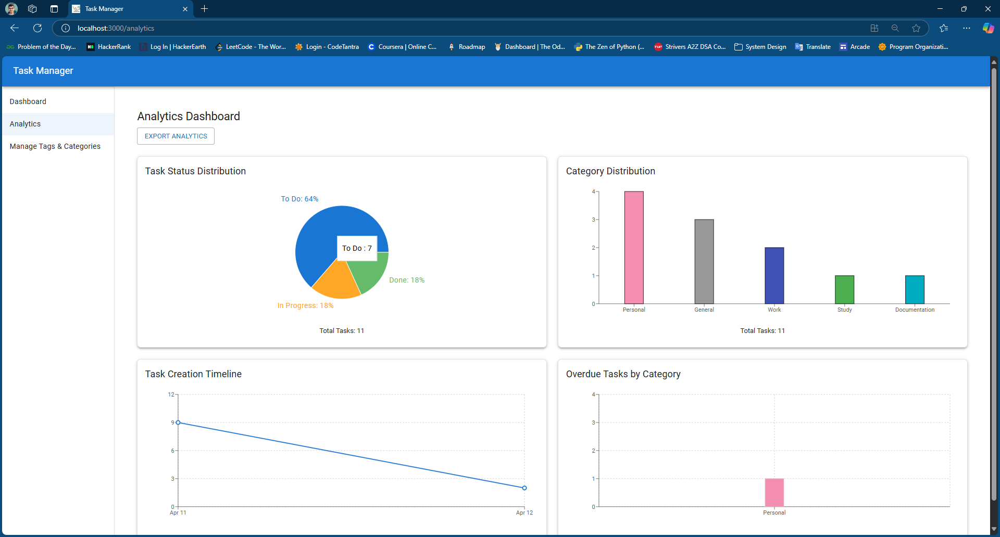
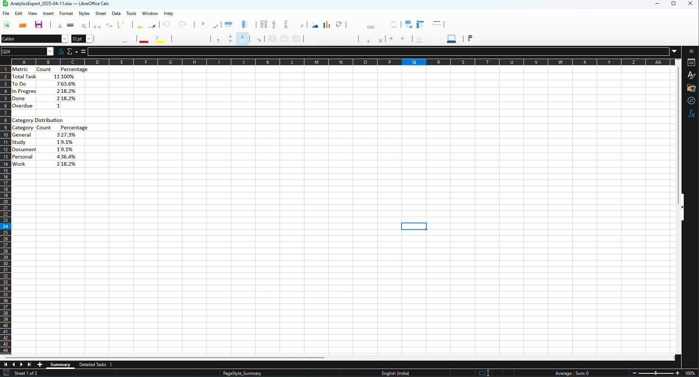

# 📋 Task Management System with Analytics

A full-featured task management web app with analytics, built using **React**, **Firebase**, and **Material UI**. Includes task tracking, data visualization, and export to Excel functionality.

---

## ✨ Features

### ✅ Task Management
- Create, edit, delete tasks
- Task fields: title, description, due date, status, category, tags
- Filter by status, category (single select), and tags (multi-select)
- Search tasks by title or description
- Toggle between **list view** and **card/grid view**

### 📊 Analytics Dashboard
- **Task Status Distribution** (Pie chart)
- **Category Distribution** (Bar chart)
- **Task Creation Timeline** (Line chart)
- **Overdue Tasks by Category** (Bar chart)
- Responsive charts using **Recharts**

### 📤 Export to Excel
- **Task Dashboard**
  - Export all or filtered tasks
  - Includes all task fields
- **Analytics Dashboard**
  - **Summary Sheet:** total tasks, task status breakdown, overdue count, category distribution with percentages
  - **Detailed Sheet:** raw task data

### 💅 UI/UX
- Built with **Material UI (MUI)**
- Responsive layout for mobile and desktop
- Toast notifications for actions (success/error)
- Light theme optimized for clarity

---

## ⚙️ Tech Stack

- **Frontend**: React, TypeScript
- **UI Library**: Material UI (MUI)
- **Charts**: Recharts
- **Export**: `xlsx` and `file-saver`
- **Backend (Persistence)**: Firebase Realtime Database
- **Date Handling**: date-fns

---

## 🚀 Setup Instructions

1. **Clone the repo**:
```bash
git clone https://github.com/your-username/task-manager-app.git
cd task-manager-app
```

2. **Install dependencies**:
```bash
npm install
```

3. **Configure Firebase**:
- Create a Firebase project
- Enable Realtime Database
- Add your Firebase config in `src/firebase/config.ts`

4. **Start the app**:
```bash
npm start
```

---

## 📁 Folder Structure (simplified)

```
src/
├── components/
│   └── Task/               # Task UI (Table, Cards, Filter, Modal)
│   └── Analytics/          # Charts for analytics
├── firebase/               # Firebase services
├── hooks/                  # Custom hooks (e.g., useToast)
├── pages/                  # Dashboard pages
├── utils/                  # Export to Excel utilities
└── types/                  # TypeScript models
```

---

## 📸 Screenshots

### 📝 Task Table View


### 🧩 Card View


### 🔍 Filters & Search


### 📊 Analytics Dashboard


### 📤 Exported Excel



---

## ✅ Assignment Requirements Covered

| Feature                                | Status   |
|----------------------------------------|----------|
| Task CRUD                              | ✅        |
| Filtering (status/category/tags)       | ✅        |
| Analytics Dashboard (4 charts)         | ✅        |
| Excel Export - Tasks (all + filtered)  | ✅        |
| Excel Export - Analytics (2 sheets)    | ✅        |
| Interactive UI with MUI                | ✅        |
| Toasts & UX feedback                   | ✅        |
| Responsive Design                      | ✅        |